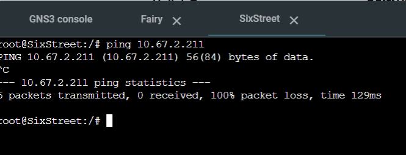

# Jarkom-Modul-5-IT07-2024

- Dimas Andhika Diputra (5027231074)
- Kharisma Fahrun Nisa (5027231086) ❌

## Topologi + Pembagian Subnet


## Spreadsheet Pembagian IP Subnet

[Spreadsheet Modul 5 Rute dan Pembagian IP - VLSM](https://docs.google.com/spreadsheets/d/1vzMeT-AXMVQzxqWQoPazOgO8B2LFJ4H2QB-AtAV6g4s/edit?usp=sharing)

## Konfigurasi Network

### NewEridu

```
#NAT
auto eth0
iface eth0 inet dhcp

#A1
auto eth1
iface eth1 inet static
	address 10.67.2.217
	netmask 255.255.255.252

#A5
auto eth2
iface eth2 inet static
	address 10.67.2.221
	netmask 255.255.255.252
```

### LuminaSquare

```
#A1
auto eth0
iface eth0 inet static
	address 10.67.2.218
	netmask 255.255.255.252
    gateway 10.67.2.217

#A2
auto eth1
iface eth1 inet static
	address 10.67.2.193
	netmask 255.255.255.248

#A4
auto eth2
iface eth2 inet static
	address 10.67.1.1
	netmask 255.255.255.0
```

### BalletTwins

```
#A2
auto eth0
iface eth0 inet static
	address 10.67.2.195
	netmask 255.255.255.248
    gateway 10.67.2.193

#A3
auto eth1
iface eth1 inet static
	address 10.67.2.1
	netmask 255.255.255.128
```

### SixStreet

```
#A5
auto eth0
iface eth0 inet static
	address 10.67.2.222
	netmask 255.255.255.252
    gateway 10.67.2.221

#A6
auto eth2
iface eth2 inet static
	address 10.67.2.201
	netmask 255.255.255.248

#A9
auto eth1
iface eth1 inet static
	address 10.67.2.209
	netmask 255.255.255.248
```

### ScootOutpost

```
#A6
auto eth0
iface eth0 inet static
	address 10.67.2.203
	netmask 255.255.255.248
    gateway 10.67.2.201

#A7
auto eth1
iface eth1 inet static
	address 10.67.2.225
	netmask 255.255.255.252
```

### OuterRing

```
#A6
auto eth0
iface eth0 inet static
	address 10.67.2.202
	netmask 255.255.255.248
    gateway 10.67.2.201

#A8
auto eth1
iface eth1 inet static
	address 10.67.2.129
	netmask 255.255.255.192
```

### HIA

```
auto eth0
iface eth0 inet static
	address 10.67.2.194
	netmask 255.255.255.248
    gateway 10.67.2.193
```

### HDD

```
auto eth0
iface eth0 inet static
	address 10.67.2.210
	netmask 255.255.255.248
    gateway 10.67.2.209
```

### Fairy

```
auto eth0
iface eth0 inet static
	address 10.67.2.211
	netmask 255.255.255.248
    gateway 10.67.2.209
```

### HollowZero

```
auto eth0
iface eth0 inet static
	address 10.67.2.226
	netmask 255.255.255.252
    gateway 10.67.2.225
```

### Client (Burnice, Caesar, Ellen, Jane, Lycaon, Policeboo)

```
auto eth0
iface eth0 inet dhcp
```

# Misi 1 No 3 + Misi 2 No 1

## routing

### NewEridu

```bash
#A2
route add -net 10.67.2.192 netmask 255.255.255.248 gw 10.67.2.218

#A3
route add -net 10.67.2.0 netmask 255.255.255.128 gw 10.67.2.218

#A4
route add -net 10.67.1.0 netmask 255.255.255.0 gw 10.67.2.218

#A6
route add -net 10.67.2.200 netmask 255.255.255.248 gw 10.67.2.222

#A7
route add -net 10.67.2.224 netmask 255.255.255.252 gw 10.67.2.222

#A8
route add -net 10.67.2.128 netmask 255.255.255.192 gw 10.67.2.222

#A9
route add -net 10.67.2.208 netmask 255.255.255.248 gw 10.67.2.222

#Otomasi iptables awal
IP_ETH0=$(ip -4 addr show eth0 | grep -oP '(?<=inet\s)\d+(\.\d+){3}')
iptables -t nat -A POSTROUTING -o eth0 -j SNAT --to-source $IP_ETH0
```

### LuminaSquare (DHCP Relay)

```bash
#A3
route add -net 10.67.2.0 netmask 255.255.255.128 gw 10.67.2.195

#A7
route add -net 10.67.2.224 netmask 255.255.255.252 gw 10.67.2.217

#A8
route add -net 10.67.2.128 netmask 255.255.255.192 gw 10.67.2.217

#A9
route add -net 10.67.2.208 netmask 255.255.255.248 gw 10.67.2.217

echo 'nameserver 192.168.122.1' > /etc/resolv.conf
```

### BalletTwins (DHCP Relay)

```bash
#A4
route add -net 10.67.1.0 netmask 255.255.255.0 gw 10.67.2.193

#A7
route add -net 10.67.2.224 netmask 255.255.255.252 gw 10.67.2.193

#A8
route add -net 10.67.2.128 netmask 255.255.255.192 gw 10.67.2.193

#A9
route add -net 10.67.2.208 netmask 255.255.255.248 gw 10.67.2.193

echo 'nameserver 192.168.122.1' > /etc/resolv.conf
```

### SixStreet (DHCP Relay)

```bash
#A2
route add -net 10.67.2.192 netmask 255.255.255.248 gw 10.67.2.221

#A3
route add -net 10.67.2.0 netmask 255.255.255.128 gw 10.67.2.221

#A4
route add -net 10.67.1.0 netmask 255.255.255.0 gw 10.67.2.221

#A7
route add -net 10.67.2.224 netmask 255.255.255.252 gw 10.67.2.203

#A8
route add -net 10.67.2.128 netmask 255.255.255.192 gw 10.67.2.202

echo 'nameserver 192.168.122.1' > /etc/resolv.conf
```

### OuterRing (DHCP Relay)

```bash
#A2
route add -net 10.67.2.192 netmask 255.255.255.248 gw 10.67.2.201

#A3
route add -net 10.67.2.0 netmask 255.255.255.128 gw 10.67.2.201

#A4
route add -net 10.67.1.0 netmask 255.255.255.0 gw 10.67.2.201

#A7
route add -net 10.67.2.224 netmask 255.255.255.252 gw 10.67.2.203

#A9
route add -net 10.67.2.208 netmask 255.255.255.248 gw 10.67.2.201

echo 'nameserver 192.168.122.1' > /etc/resolv.conf
```

### ScootOutpost

```bash
#A2
route add -net 10.67.2.192 netmask 255.255.255.248 gw 10.67.2.201

#A3
route add -net 10.67.2.0 netmask 255.255.255.128 gw 10.67.2.201

#A4
route add -net 10.67.1.0 netmask 255.255.255.0 gw 10.67.2.201

#A8
route add -net 10.67.2.128 netmask 255.255.255.192 gw 10.67.2.202

#A9
route add -net 10.67.2.208 netmask 255.255.255.248 gw 10.67.2.201

echo 'nameserver 192.168.122.1' > /etc/resolv.conf
```

### Fairy (DHCP Server)

```bash
echo 'nameserver 192.168.122.1' > /etc/resolv.conf
```

### HDD (DNS Server)

```bash
echo 'nameserver 192.168.122.1' > /etc/resolv.conf
```

### HIA & HollowZero (Apache Worker)

```bash
echo 'nameserver 192.168.122.1' > /etc/resolv.conf
```

### Misi 2 Nomor 1 (sudah di atas)

1. Agar NewEridu terhubung ke internet pakai iptables tanpa MASQUERADE

```
iptables -t nat -A POSTROUTING -o eth0 -j SNAT --to-source [IP eth0]
```

# Misi 1 No 4

menginstall dan menambahkan konfigurasi sesuai yang diminta misi 1 no 4

### LuminaSquare (DHCP Relay)

```bash
apt-get update
apt install isc-dhcp-relay -y

echo 'SERVERS="10.67.2.211"
INTERFACES="eth0 eth1 eth2 eth3"
OPTIONS=""
' > /etc/default/isc-dhcp-relay

echo 'net.ipv4.ip_forward=1' >> /etc/sysctl.conf

service isc-dhcp-relay restart
```

### BalletTwins (DHCP Relay)

```bash
apt-get update
apt install isc-dhcp-relay -y

echo 'SERVERS="10.67.2.211"
INTERFACES="eth0 eth1 eth2 eth3"
OPTIONS=""
' > /etc/default/isc-dhcp-relay

echo 'net.ipv4.ip_forward=1' >> /etc/sysctl.conf

service isc-dhcp-relay restart
```

### SixStreet (DHCP Relay)

```bash
apt-get update
apt install isc-dhcp-relay -y

echo 'SERVERS="10.67.2.211"
INTERFACES="eth0 eth1 eth2 eth3"
OPTIONS=""
' > /etc/default/isc-dhcp-relay

echo 'net.ipv4.ip_forward=1' >> /etc/sysctl.conf

service isc-dhcp-relay restart
```

### OuterRing (DHCP Relay)

```bash
apt-get update
apt install isc-dhcp-relay -y

echo 'SERVERS="10.67.2.211"
INTERFACES="eth0 eth1 eth2 eth3"
OPTIONS=""
' > /etc/default/isc-dhcp-relay

echo 'net.ipv4.ip_forward=1' >> /etc/sysctl.conf

service isc-dhcp-relay restart
```

### Fairy (DHCP Server)

```bash
apt-get update
apt-get install isc-dhcp-server netcat -y

echo 'INTERFACESv4="eth0"' > /etc/default/isc-dhcp-server

echo '#A8
subnet 10.67.2.128 netmask 255.255.255.192 {
        range 10.67.2.130 10.67.2.190;
        option routers 10.67.2.129; # Gateway
        option broadcast-address 10.67.2.191;
        option domain-name-servers 10.67.2.210; #IP HDD
        default-lease-time 600;
        max-lease-time 7200;
}

#A4
subnet 10.67.1.0 netmask 255.255.255.0 {
        range 10.67.1.2 10.67.1.254;
        option routers 10.67.1.1;
        option broadcast-address 10.67.1.255;
        option domain-name-servers 10.67.2.210;
        default-lease-time 600;
        max-lease-time 7200;
}

#A3
subnet 10.67.2.0 netmask 255.255.255.128 {
        range 10.67.2.2 10.67.2.126;
        option routers 10.67.2.1;
        option broadcast-address 10.67.2.127;
        option domain-name-servers 10.67.2.210;
        default-lease-time 600;
        max-lease-time 7200;
}

subnet 10.67.2.216 netmask 255.255.255.252 {}
subnet 10.67.2.192 netmask 255.255.255.248 {}
subnet 10.67.2.220 netmask 255.255.255.252 {}
subnet 10.67.2.200 netmask 255.255.255.248 {}
subnet 10.67.2.224 netmask 255.255.255.252 {}
subnet 10.67.2.208 netmask 255.255.255.248 {}
' > /etc/dhcp/dhcpd.conf

service isc-dhcp-server restart
```

### HDD (DNS Server)

```bash
apt-get update
apt-get install bind9 netcat -y

echo 'options {
        directory "/var/cache/bind";

        forwarders {
                192.168.122.1;
        };

        // dnssec-validation auto;
        allow-query{any;};
        auth-nxdomain no;
        listen-on-v6 { any; };
}; ' >/etc/bind/named.conf.options

service bind9 restart
```

### HIA & HollowZero (Apache Worker)

```bash
apt-get update
apt-get install apache2 netcat -y

service apache2 start

echo 'Welcome to {hostname}' > /var/www/html/index.html

service apache2 restart
```

sesuaikan hostnamenya!

# Misi 2

no 1 sudah

---

2. RULE: Tidak ada node yang bisa ping ke Fairy tapi Fairy tetap bisa ping ke node lain

### Fairy

```bash
# Blokir semua ping yang ditujukan ke Fairy
iptables -A INPUT -p icmp --icmp-type echo-request -j DROP

#Perbolehkan ping yang berasal dari Fairy
iptables -A OUTPUT -p icmp --icmp-type echo-request -j ACCEPT
```

**testing fairy ping node lain**


**testing node lain ping ke fairy**


---

3. RULE: HDD hanya bisa diakses oleh Fairy

### HDD

```bash
#Izinkan koneksi dari Fairy
iptables -A INPUT -s 10.67.2.211 -j ACCEPT

#Tolak semua koneksi dari sumber lain
iptables -A INPUT -j REJECT
```

**testing fairy ping ke hdd**


**testing node lain ping ke hdd**


---

4. RULE: HollowZero hanya bisa diakses oleh 4 node dan hanya di hari Senin hingga Jumat

### HollowZero

```bash
iptables -A INPUT -p tcp -s 10.67.2.130 --dport 80 -m time --timestart 00:00 --timestop 23:59 --weekdays Mon,Tue,Wed,Thu,Fri -j ACCEPT

iptables -A INPUT -p tcp -s 10.67.2.131 --dport 80 -m time --timestart 00:00 --timestop 23:59 --weekdays Mon,Tue,Wed,Thu,Fri -j ACCEPT

iptables -A INPUT -p tcp -s 10.67.1.3 --dport 80 -m time --timestart 00:00 --timestop 23:59 --weekdays Mon,Tue,Wed,Thu,Fri -j ACCEPT

iptables -A INPUT -p tcp -s 10.67.1.2 --dport 80 -m time --timestart 00:00 --timestop 23:59 --weekdays Mon,Tue,Wed,Thu,Fri -j ACCEPT

iptables -A INPUT -p tcp --dport 80 -j REJECT
```

saat pengetesan ip burnice = 10.67.2.130<br>
saat pengetesan ip caesar = 10.67.2.131<br>
saat pengetesan ip jane = 10.67.1.3<br>
saat pengetesan ip policeboo = 10.67.1.2

**test**


---

5. RULE: HIA hanya bisa diakses oleh Ellen dan Lycaon pada pukul 08:00 - 21:00 dan bisa diakses oleh Jane serta Policeboo hanya pada pukul 03:00 - 23:00

### HIA

```bash
# Akses Node Ellen dan Lycaon (08:00 - 21:00)
iptables -A INPUT -p tcp -s 10.67.2.2 --dport 80 -m time --timestart 01:00 --timestop 14:00 --weekdays Mon,Tue,Wed,Thu,Fri,Sat,Sun -j ACCEPT

iptables -A INPUT -p tcp -s 10.67.2.3 --dport 80 -m time --timestart 01:00 --timestop 14:00 --weekdays Mon,Tue,Wed,Thu,Fri,Sat,Sun -j ACCEPT

# Akses Node Jane dan Policeboo (03:00 - 23:00)
iptables -A INPUT -p tcp -s 10.67.1.3 --dport 80 -m time --timestart 20:00 --timestop 16:00 --weekdays Mon,Tue,Wed,Thu,Fri,Sat,Sun -j ACCEPT

iptables -A INPUT -p tcp -s 10.67.1.2 --dport 80 -m time --timestart 20:00 --timestop 16:00 --weekdays Mon,Tue,Wed,Thu,Fri,Sat,Sun -j ACCEPT

# Tolak semua koneksi lainnya
iptables -A INPUT -p tcp --dport 80 -j REJECT
```

ip ellen saat pengetesan = 10.67.2.2<br>
ip lycaon saat pengetesan = 10.67.2.3<br>
ip jane saat pengetesan = 10.67.1.3<br>
ip policeboo saat pengetesan = 10.67.1.2

> Catatan: Karena konfigurasi iptables menggunakan format waktu UTC atau GMT 0, maka waktu harus disesuaikan dengan permintaan soal dan perbedaan waktunya (WIB = GMT +7)

**tes**


---

6. RULE: HIA harus memblokir aktivitas port scanning yang melebihi 25 port dalam rentang 10 detik, penyerang yang diblokir tidak bisa ping, nc, atau curl ke HIA, log dari iptables akan tercatat untuk analisis.

```bash
# Atur rate limit untuk port scanning (maksimum 25 koneksi per 10 detik)
iptables -N PORTSCAN
iptables -A INPUT -p tcp --dport 1:100 -m state --state NEW -m recent --set --name portscan
iptables -A INPUT -p tcp --dport 1:100 -m state --state NEW -m recent --update --seconds 10 --hitcount 25 --name portscan -j PORTSCAN

# Blokir IP yang terdeteksi melakukan port scanning tidak wajar
iptables -A PORTSCAN -m recent --set --name blacklist
iptables -A PORTSCAN -j DROP

# Blokir semua aktivitas dari IP yang ada di daftar blacklist
iptables -A INPUT -m recent --name blacklist --rcheck -j REJECT
iptables -A OUTPUT -m recent --name blacklist --rcheck -j REJECT

# Logging untuk port scanning
iptables -A PORTSCAN -j LOG --log-prefix='PORT SCAN DETECTED' --log-level 4
```

Test scan port dengan nmap: `nmap -p 1-100 10.67.2.194`

**testing**


---


---

7. RULE: Untuk hollow hanya ada 2 koneksi aktif dari 2 IP berbeda dalam waktu bersamaan yang diperbolehkan

### HollowZero

```bash
# Hanya izinkan maksimal 2 koneksi aktif dari 2 IP berbeda
iptables -A INPUT -p tcp --dport 80 -m conntrack --ctstate NEW -m recent --set
iptables -A INPUT -p tcp --dport 80 -m conntrack --ctstate NEW -m recent --update --seconds 1 --hitcount 3 -j REJECT
iptables -A INPUT -p tcp --dport 80 -j ACCEPT
```

Test dengan `parallel curl -s http://IP-HollowZero ::: IP-Caesar IP-Burnice IP-Jane IP-Policeboo`

`parallel curl -s http://10.67.2.226 ::: 10.67.2.131 10.67.2.130 10.67.1.2 10.67.1.3`

**testing**


---

8. Agar setiap paket yang dikirimkan ke Burnice dapat dialihkan ke HollowZero

### Burnice

```bash
iptables -t nat -A PREROUTING -p tcp -j DNAT --to-destination 10.67.2.226 --dport 3030
iptables -A FORWARD -p tcp -d 10.67.2.226 -j ACCEPT
```

Untuk melakukan verifikasi di HollowZero bisa dengan menggunakan tcpdump seperti ini `tcpdump -i eth0 host 10.67.2.211 and port 3030`

**testing**


